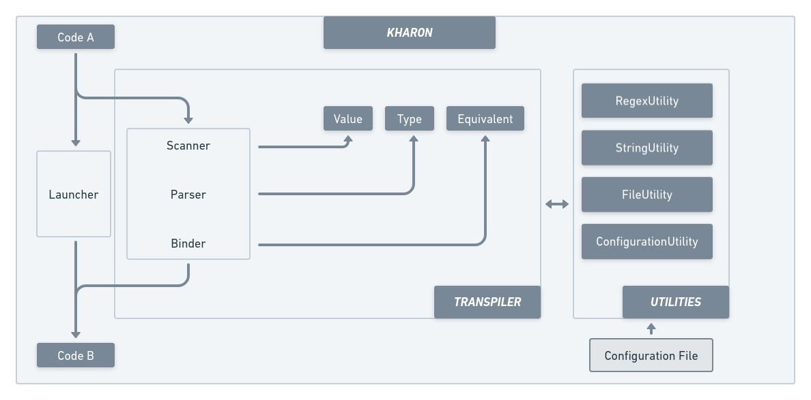
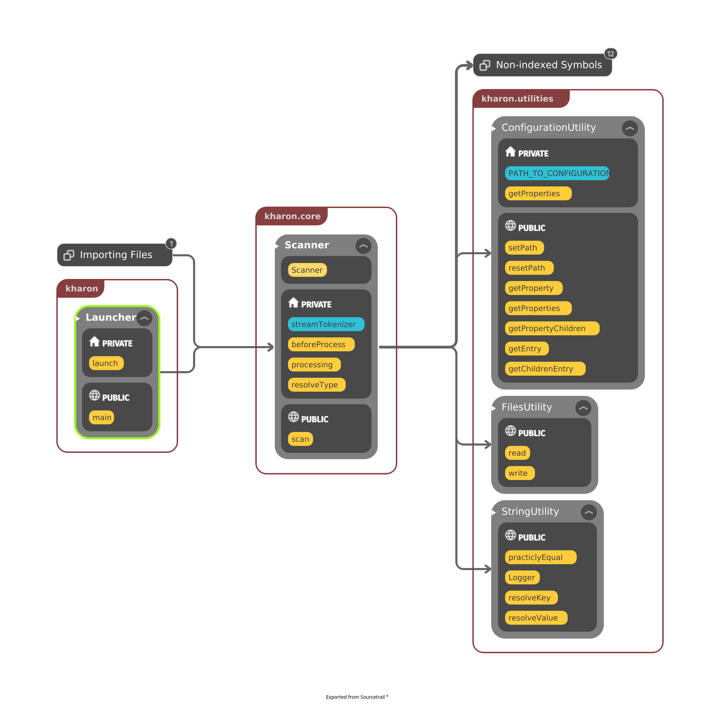
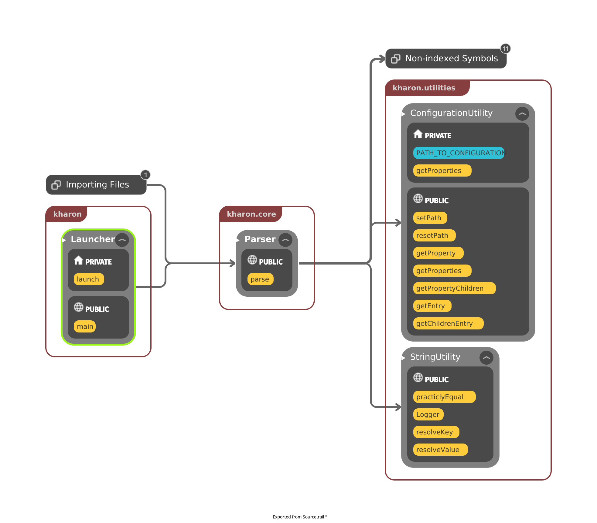
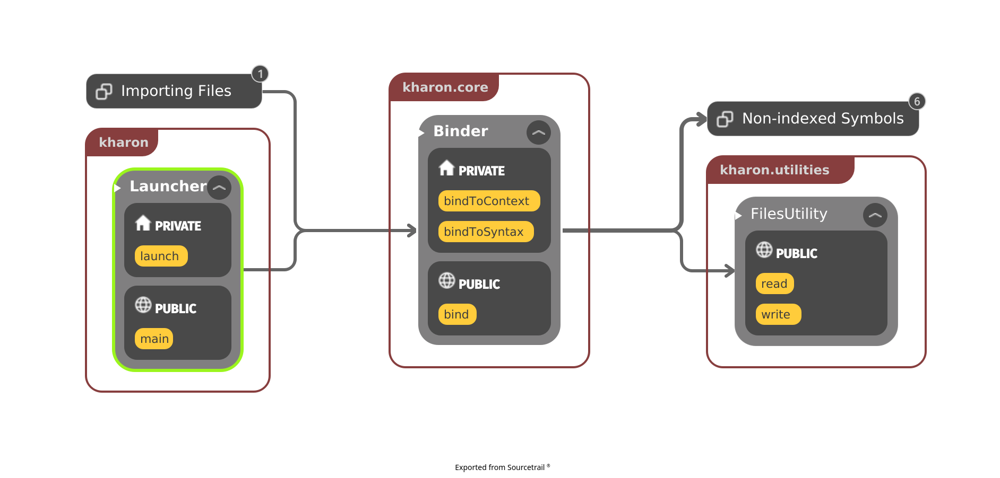

# KHARON

> **Long Answer:** In Greek mythology, Charon or Kharon (/ˈkɛərɒn, -ən/; Ancient Greek: Χάρων) is a psychopomp, the ferryman of Hades, the Greek underworld. He carries the souls of those who have been given funeral rites across the rivers Acheron and Styx, which separate the worlds of the living and the dead. Inspired by this story we created this transpiler that can convert a defined language to another by only redifining the [configuration](./app/src/main/resources/configuration.properties) file.

> **Short Answer:** Translator that operates on a code of a programming language A, and create it's equivalent in a programming language B, according to a set of rules defined in the [configuration](./app/src/main/resources/configuration.properties) file.

## Specification:

